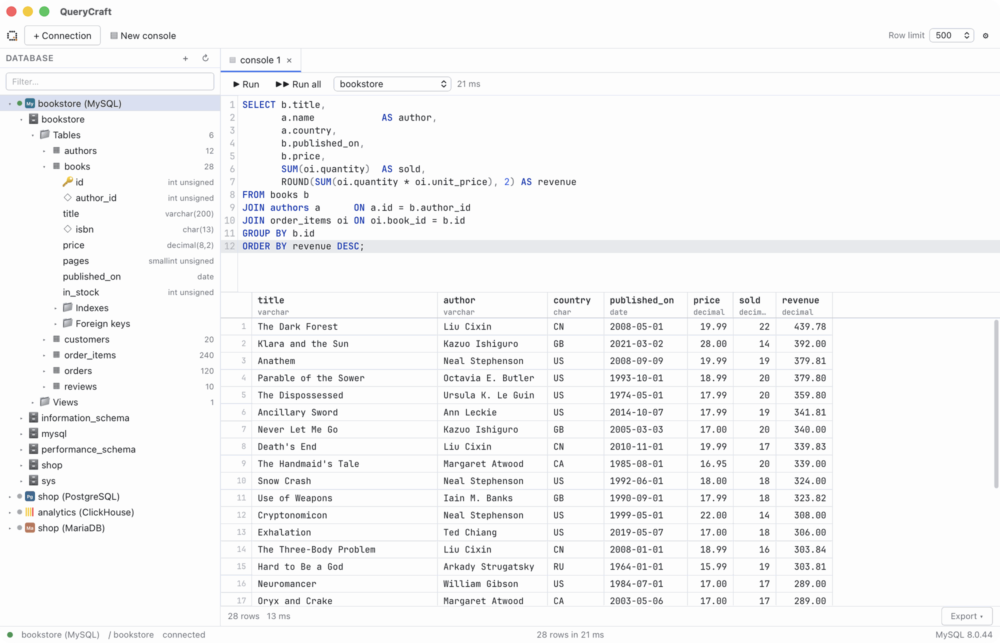

# QueryCraft

Fast, lightweight desktop client for MySQL, MariaDB, PostgreSQL, SQL Server, ClickHouse, SQLite, Redis and
Valkey in the spirit of DataGrip. macOS, Windows and Linux.

Built with Tauri 2 (Rust: `mysql_async`, `tokio-postgres`, `tiberius`, `rusqlite`, the ClickHouse HTTP interface,
`redis`) and React 19 / TypeScript, CodeMirror 6 and a virtualized grid.
The binary is small, it starts in well under a second, and it uses a fraction of the memory of Electron-based tools.
See [docs/ARCHITECTURE.md](docs/ARCHITECTURE.md) for the design.

> QueryCraft is under active development. Expect rough edges and please [report them](https://github.com/camuig/querycraft/issues).

<picture>
  <source media="(prefers-color-scheme: dark)" srcset="docs/screenshots/console-dark.png">
  
</picture>

## Features

- **Eight engines** — MySQL, MariaDB, PostgreSQL, SQL Server, ClickHouse, SQLite, Redis and Valkey, each
  with its own icon in the explorer. The SQL engines share a schema-aware SQL editor with per-dialect
  identifier quoting; Redis and Valkey get their own key-value console instead (see
  [The Redis/Valkey console](#the-redisvalkey-console)). See [Engine notes](#engine-notes) for what differs.
- **Connections** — create, test and edit connections; passwords are stored in the system keyring
  (Keychain, Credential Manager, Secret Service), never in plain-text files. SQLite connections point at
  a file (or `:memory:`).
- **SSL/TLS** — the server certificate is verified against the system trust store by default; an extra
  CA certificate file (PEM) can be added for private CAs, and verification can be switched off for
  self-signed certificates on a trusted network.
- **SSH tunnel** — as in DataGrip's SSH/SSL tab: reach the database through an SSH host with a password,
  a private key (optionally with a passphrase) or the running OpenSSH agent. Host keys are checked against
  `~/.ssh/known_hosts` like `StrictHostKeyChecking=accept-new`: a new host is recorded, a changed key is
  refused. The SSH password or passphrase follows the "Save password" setting.
- **Database explorer** — databases (schemas for PostgreSQL) → tables and views → columns, indexes,
  foreign keys; for Redis/Valkey, databases 0–15 → keys, loaded with `SCAN` and filterable by pattern.
  SQL Server tables carry their schema in the name (`schema.table`, e.g. `dbo.Orders`) and are qualified
  as `"db"."schema"."table"` in generated SQL. Lazy loading, filtering, context menus, keyboard navigation.
- **SQL console** — syntax highlighting and schema-aware autocomplete in the engine's dialect; run the
  statement under the cursor, the selection or the whole script; cancel running queries; multiple result
  sets with timings. Redis/Valkey connections get a dedicated command console instead — see
  [The Redis/Valkey console](#the-redisvalkey-console).
- **Session per tab** — every console and data tab owns its own connection, so `USE`, transactions and
  temporary tables stay scoped to the tab, exactly like DataGrip.
- **Results grid** — row and column virtualization, sorting, resizable columns, DataGrip-style selection
  (drag, Shift+click, Shift+arrows, row and column selection, select all), copy as TSV/CSV with or without
  headers, export to CSV / JSON / Excel files or copy as TSV / SQL `INSERT`. The row limit only applies to the
  grid: a file export of a truncated result re-runs the statement without the limit and writes every row, and
  clicking the `500+ rows` count in the footer runs `SELECT COUNT(*)` over the statement to show the total.
- **Table data editing** — `WHERE` filter with column and keyword suggestions, sorting, pagination, inline
  cell editing, add and delete rows, deferred Submit / Revert applied in a single transaction, SQL preview.
- **Clipboard paste** into the grid: each line becomes a row, missing rows are added, tab / `;` / `,` / `|`
  split values across columns, `NULL` and empty cells become SQL NULL; a single value fills a selected range.
- **DDL view** — `SHOW CREATE TABLE` (synthesized from the catalog for PostgreSQL) with highlighting.
- **Themes** — system (follows the OS and switches live), light and dark.
- **Native menu** and **DataGrip keymap** (see below); settings dialog for theme, row limit, editor font size
  and updates.
- **Automatic updates** — new releases are downloaded from GitHub at startup and applied after a restart
  (see [Updates](#updates)).
- **AI assistant** — bring your own API key to generate SQL from a description or fix a failing
  statement, right from the console (see [AI assistant](#ai-assistant)).

## Keyboard shortcuts

Shortcuts follow the DataGrip defaults for each platform.

| Action | macOS | Windows / Linux |
|---|---|---|
| Execute statement / selection | ⌘⏎ | Ctrl+Enter |
| Execute whole script | ⇧⌘⏎ | Ctrl+Shift+Enter |
| Cancel running query | ⌘F2 | Ctrl+F2 |
| New query console | ⌃⇧Q | Ctrl+Shift+Q |
| Refresh explorer / reload page | ⌘R | Ctrl+F5 |
| Submit changes | ⌘⏎ | Ctrl+Enter |
| Revert changes | ⌥⌘Z | Ctrl+Alt+Z |
| Add row | ⌘N | Alt+Insert |
| Delete / restore selected rows | ⌘⌫, or ⌫ / Delete in the grid | Ctrl+Y, or Delete / Backspace in the grid |
| Set NULL | ⌥⌘N | Ctrl+Alt+N |
| Next / previous page | ⌥⌘↓ / ⌥⌘↑ | Ctrl+Alt+↓ / Ctrl+Alt+↑ |
| Open table data (explorer) | F4 | F4 |
| Go to DDL (explorer) | ⌘B | Ctrl+B |
| Database explorer | ⌘1 | Alt+1 |
| Close tab | ⌘W | Ctrl+F4 |
| Next / previous tab | ⇧⌘] / ⇧⌘[ | Alt+→ / Alt+← |
| Settings | ⌘, | Ctrl+Alt+S |
| Generate SQL with AI | ⌘\ | Ctrl+\ |
| Copy selection (TSV) | ⌘C | Ctrl+C |
| Paste into grid | ⌘V | Ctrl+V |
| Select all cells | ⌘A | Ctrl+A |

In the SQL editor: duplicate line or selection ⌘D / Ctrl+D, delete line ⌘⌫ / Ctrl+Y, move line ⌥⇧↑ / ⌥⇧↓,
toggle line comment ⌘/ / Ctrl+/, find ⌘F / Ctrl+F.

The keymap lives in [`src/lib/keymap.ts`](src/lib/keymap.ts).

## Engine notes

| | MySQL / MariaDB | PostgreSQL | SQL Server | ClickHouse | SQLite | Redis / Valkey |
|---|---|---|---|---|---|---|
| Transport | `mysql_async` (native protocol, TLS) | `tokio-postgres` (TLS) | `tiberius` (TDS, TLS via rustls) | HTTP interface (`reqwest`), port 8123 | `rusqlite` (bundled SQLite) | `redis` crate (RESP, TLS) |
| Explorer level under the connection | databases | schemas of the connected database | databases | databases | `main` and attached databases | databases 0–15 (keys) |
| Session per tab | dedicated connection, `USE db` | dedicated connection, `search_path` | dedicated connection, `USE db` | HTTP `session_id` + `database` | dedicated connection | dedicated connection, `SELECT db` |
| Cancel | `KILL QUERY` | cancel request | `KILL <spid>` | `KILL QUERY WHERE query_id = …` | `sqlite3_interrupt` | `CLIENT KILL ID` |
| SSH tunnel | yes | yes | yes | yes | no (local file) | yes |
| Grid editing | by primary key | by primary key | by primary key | read-only | by primary key | key values (by type) |
| DDL | `SHOW CREATE TABLE` | synthesized from the catalog | synthesized from the catalog | `SHOW CREATE TABLE` | `sqlite_master.sql` | n/a |

PostgreSQL results are fetched with the simple query protocol (every value arrives as text and is typed by
the prepared statement's description), so a console `SELECT` without `LIMIT` is buffered before the row
limit is applied. ClickHouse has no row-level `UPDATE`/`DELETE`, so its data tabs are read-only. SQL Server
has no `LIMIT`/`OFFSET`; table data paging uses `OFFSET … ROWS FETCH NEXT … ROWS ONLY`, which requires an
`ORDER BY` (a page without an explicit sort falls back to `ORDER BY (SELECT NULL)`). SQL Server is the one
backend on `rustls` rather than `native-tls`: SQL Server always TLS-wraps its login packet, and on macOS
`native-tls` (the system Security framework) cannot complete that handshake at all.

## The Redis/Valkey console

Redis and Valkey connections speak commands, not SQL: the console runs one command per line in
redis-cli syntax (`SET "my key" "a value"`, `"…"` with backslash escapes or `'…'`, `#` lines are
comments). Cmd/Ctrl+Enter runs the command on the cursor's line; Cmd/Ctrl+Shift+Enter runs every line
in the console top to bottom. Results are shown as an ordinary grid: `HGETALL` returns `field`/`value`
rows, `ZRANGE … WITHSCORES` returns `member`/`score`, `SCAN` returns the next cursor and the matching
keys. The editor highlights the ~120 built-in commands and completes them, plus key names for the
current database. `SUBSCRIBE`/`PSUBSCRIBE` and `MONITOR` are refused in the console — they never
return, which does not fit a request/response query tab.

The explorer lists databases 0–15 under a Redis/Valkey connection; expanding one loads its keys with
`SCAN` (first 1,000, marked `1,000+` when there are more). The filter box becomes a server-side `MATCH`
pattern instead of filtering the already-loaded list, so it works for a database with far more keys than
fit in the tree. Double-clicking a key opens its own tab with the full value in a grid shaped by the
key's type: a string is one `value` cell, a hash is `field`/`value` rows, a list is `index`/`element`
rows (the index is read-only), a set is `member` rows, a sorted set is `member`/`score` rows, and a
stream is its `id`/entry rows shown read-only. Cells can be edited, rows added or deleted (not for
strings or streams); Submit sends every pending change as one batch of commands that runs atomically
(Redis `MULTI`/`EXEC`), Revert discards them. The tab also has its own TTL control (set an expiry in
seconds, or clear it with Persist) and a two-click "Delete key". The context menu's "Open in console"
runs the same type-based preview command as a plain query instead, for a quick read-only look.

TLS connections to Redis/Valkey verify the server certificate against the system trust store only: the
`redis` crate's native-TLS backend cannot load an extra CA certificate file, so for a private CA either
add it to the system trust store or turn certificate verification off for that connection.

## AI assistant

QueryCraft ships a bring-your-own-key (BYOK) AI assistant for two things: generating a SQL statement
from a plain-language description, and fixing a statement that just failed. There is no bundled
service and no telemetry — every request goes straight from your machine to the provider you chose,
using your own API key.

**Providers** — Anthropic, OpenAI, Google Gemini, OpenRouter, DeepSeek, Mistral, a local Ollama or LM
Studio server (no key needed), or any other OpenAI-compatible endpoint. Configure one in *Settings →
AI* (`Cmd+,` / `Ctrl+Alt+S`): pick a provider, paste an API key (pasting a recognized key format
switches to the matching provider automatically), choose a model and, for local/custom providers, a
base URL. API keys are stored in the system keyring (Keychain, Credential Manager, Secret Service),
never in a plain-text file, and never sent anywhere except the provider's own API.

**Generate SQL** — in a SQL console, click **✦ AI** in the toolbar or press `Cmd+\` / `Ctrl+\` to open
the assist bar. With no selection, describe the query you need and it is inserted at the cursor; with
a SQL selection, describe how it should change and the selection is rewritten. The answer streams in
as a read-only preview; **Accept** applies it as a single undoable edit, **Copy** copies it, **Regenerate**
asks again, and the input stays open for a follow-up refinement. A statement that would `DROP`,
`TRUNCATE`, or `DELETE`/`UPDATE` without a `WHERE` clause is flagged before you accept it.

**Fix with AI** — a failed statement's result shows a **✦ Fix with AI** button that opens the same bar
already working on a fix, using the statement and the error message.

**Per-connection access level** — each connection's *AI assistant* setting (in its General tab)
controls what the assistant may see for that connection: *Query and schema* sends the query text and
the schema of the tables involved (names, columns, types, keys, comments — never row data); *Query
only* sends just the query/error text with no schema; *Off* disables the assistant entirely for that
connection.

## Installation

Download the installer for your platform from the
[Releases](https://github.com/camuig/querycraft/releases) page (`.dmg` for macOS on Apple Silicon and Intel,
`.msi` / `.exe` for Windows, `.AppImage` / `.deb` / `.rpm` for Linux), or build from source as described below.

The binaries are not code-signed or notarized yet, so both macOS and Windows warn before the first launch.

### macOS: "QueryCraft is damaged and can't be opened"

Apple has not notarized the app, so Gatekeeper refuses it after the download. Copy `QueryCraft.app` to
*Applications*, then run this command once in Terminal to clear the quarantine flag:

```bash
xattr -dr com.apple.quarantine /Applications/QueryCraft.app
```

After that the app opens normally. Repeat the command after installing a new version.

### Windows: "unknown publisher"

SmartScreen shows a warning for the installer: choose *More info* → *Run anyway*.

### Updates

At startup QueryCraft checks the latest GitHub release and, if it is newer, downloads it in the background:
on macOS and Linux (AppImage) the new version is installed at once and starts at the next launch, on Windows
the installer runs when you agree to restart. A notification with a *Restart* button appears when the update
is ready; *Help → Check for Updates…* (or *Check now* in Settings) runs the check by hand. The startup check
can be switched off in Settings (*Check for updates at startup and install them automatically*). Every update
is verified against the public key embedded in the app before it is installed. Installations from `.deb` /
`.rpm` are left to the package manager: the app only shows a short notice with a link to the new release.

## Development

Requirements: Rust (stable), Node.js 20+, [pnpm](https://pnpm.io) and the
[Tauri system dependencies](https://tauri.app/start/prerequisites/).

```bash
pnpm install
pnpm tauri dev        # run the desktop app with hot reload
pnpm tauri build      # build the installer for the current OS
pnpm test             # frontend unit tests (vitest)
pnpm typecheck        # tsc --noEmit
pnpm lint             # biome (lint + format check); pnpm lint:fix applies fixes
cd src-tauri && cargo test   # backend unit tests
```

The UI can be developed in a regular browser without Tauri: run `pnpm dev` and open http://localhost:1420 —
IPC commands are served by a mock (`src/api/mock.ts`) with sample connections and data.

Development builds keep connection passwords in `secrets.dev.json` next to `connections.json` in the app's
config directory instead of the system keyring: the keyring grants access per code signature, and every
rebuild would ask for the keychain password again. Set `QUERYCRAFT_KEYRING=1` to use the keyring in a
development build; release builds always do.

Backend integration tests against live servers are skipped unless the DSN is provided
(`host:port:user:password`); the SQLite suite needs nothing and always runs:

```bash
cd src-tauri
QUERYCRAFT_TEST_DSN="127.0.0.1:33070:root:secret" cargo test --test live_mysql
QUERYCRAFT_TEST_PG_DSN="127.0.0.1:33071:postgres:secret" cargo test --test live_postgres
QUERYCRAFT_TEST_CH_DSN="127.0.0.1:33072:default:secret" cargo test --test live_clickhouse
cargo test --test sqlite
```

Throwaway servers for development on those ports (MySQL 33070, PostgreSQL 33071, ClickHouse 33072,
MariaDB 33073; password `secret`, database `shop`) are defined in `docker-compose.yml`:

```bash
docker compose up -d            # or: docker compose up -d postgres
```

The TLS suite expects servers with a self-signed certificate (`scripts/tls-servers.sh` starts them,
ClickHouse HTTPS on 33074) and checks that connections are encrypted, that certificate verification
rejects the untrusted certificate and that the generated CA file makes it pass. The SSH suite needs the
OpenSSH container from `scripts/ssh-server.sh` (port 33075, joined with the database containers on a
docker network) and covers password, key, passphrase and agent authentication, changed host keys and
TLS verification through the tunnel:

```bash
scripts/tls-servers.sh && scripts/ssh-server.sh
cd src-tauri
QUERYCRAFT_TEST_TLS=1 cargo test --test live_tls
QUERYCRAFT_TEST_SSH=1 cargo test --test live_ssh
# agent authentication: load the test key into an agent first
ssh-add "${TMPDIR:-/tmp}/querycraft-ssh/id_ed25519" && QUERYCRAFT_TEST_SSH=1 QUERYCRAFT_TEST_SSH_AGENT=1 cargo test --test live_ssh
```

Application icons are generated from `src/assets/logo-icon.svg` with `pnpm icons` (requires `rsvg-convert`).

Release builds sign the updater artifacts with a [minisign](https://jedisct1.github.io/minisign/) key: the
public key lives in `src-tauri/tauri.conf.json` (`plugins.updater.pubkey`), the private key is the
`TAURI_SIGNING_PRIVATE_KEY` repository secret (plus `TAURI_SIGNING_PRIVATE_KEY_PASSWORD`) used by
`release.yml`, which also uploads the `latest.json` manifest the app polls. A local `pnpm tauri build`
needs the same variables (`pnpm tauri signer generate -w ~/.tauri/querycraft.key` creates a new pair, but
apps built with the old public key cannot verify updates signed with a new one).

## Project layout

```
src-tauri/   Rust backend: Tauri commands, native menu, engine drivers, SQL execution, schema metadata
src/         React frontend: api (IPC contract), store (zustand), lib (pure functions + tests), components
docs/        Architecture notes and README screenshots
```

## Contributing

Contributions are welcome — please read [CONTRIBUTING.md](CONTRIBUTING.md) first.
This project follows a [Code of Conduct](CODE_OF_CONDUCT.md).

## License

QueryCraft is released under the [Apache License 2.0](LICENSE).
